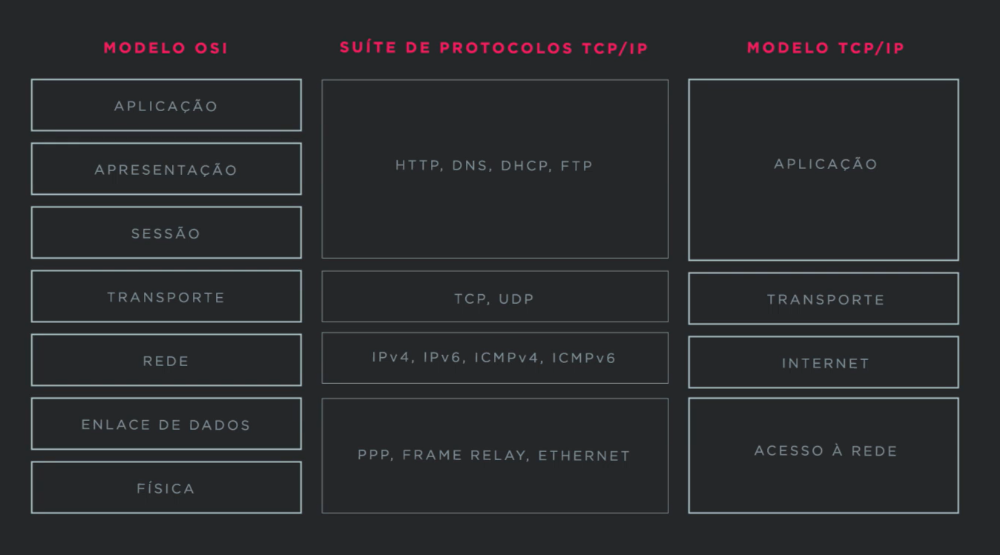
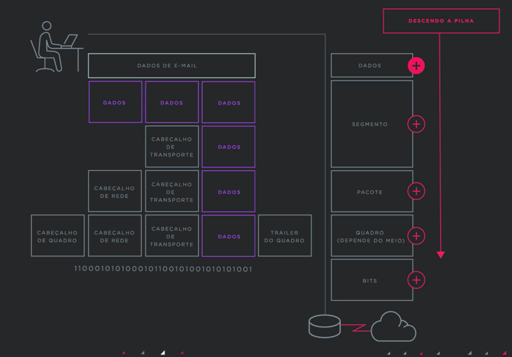

# 🌐 Comunicação em Redes: Camadas, Ciclo de Mensagens e Encapsulamento

---

## 🔁 Ciclo de Comunicação de uma Mensagem

A transmissão de uma mensagem em uma rede envolve múltiplas etapas técnicas, cada uma com papel fundamental:

| Etapa                      | Descrição |
|---------------------------|-----------|
| **Codificação da Mensagem** | Conversão de dados (texto, imagem, etc.) para linguagem binária que possa ser transmitida. |
| **Formatação e Encapsulamento** | Dados são organizados em pacotes com headers específicos por camada. |
| **Tamanho da Mensagem**     | Determinado pelos protocolos (ex: MTU na camada de enlace). |
| **Temporizador de Mensagem** | Define limite de tempo para resposta ou reenvio. Exemplo: temporizadores TCP. |
| **Opções de Envio**         | Pode ser unicast, multicast, broadcast. |
| **Codificação de Resposta** | A mensagem de volta também passa pelo mesmo ciclo, espelhando o processo. |

---

## 🧱 Modelo em Camadas: TCP/IP (Pilha de Protocolos)

A comunicação entre dispositivos em redes modernas segue um modelo em camadas. Cada camada possui responsabilidades específicas e protocolos associados.

| Camada               | Nome na Pilha TCP/IP | Exemplo de Protocolo |
|----------------------|----------------------|-----------------------|
| **Camada 4**         | Aplicação            | HTTP, FTP, DNS        |
| **Camada 3**         | Transporte            | TCP, UDP              |
| **Camada 2**         | Internet              | IP, ICMP              |
| **Camada 1**         | Acesso à Rede         | Ethernet, Wi-Fi       |

> Cada camada **se comunica diretamente apenas com sua camada adjacente** e **encapsula os dados da camada superior** com suas próprias informações.

# 🧱 Modelo em Camadas TCP/IP: Explicação Detalhada

O modelo TCP/IP (ou **modelo da Internet**) é uma arquitetura de rede em camadas usada como base para a comunicação entre dispositivos em redes modernas — incluindo a Internet. Cada camada tem responsabilidades específicas, trabalhando de forma independente, mas integrada.

---

## 📦 Visão Geral das Camadas

| Camada | Nome                    | Função Principal                             | Exemplos de Protocolos       |
|--------|-------------------------|----------------------------------------------|------------------------------|
| 4      | Aplicação               | Interface com o usuário e software           | HTTP, FTP, DNS, SMTP         |
| 3      | Transporte              | Conexão fim-a-fim e integridade de dados     | TCP, UDP                     |
| 2      | Internet                | Endereçamento e roteamento entre redes       | IP, ICMP, ARP                |
| 1      | Acesso à Rede (Link)    | Transmissão física e lógica de dados         | Ethernet, Wi-Fi, PPP, DSL    |

---

## 🔝 Camada 4 – Aplicação

### 📌 Função:
Responsável por **fornecer serviços de rede para os aplicativos** do usuário (como navegadores, e-mails, etc). É a camada mais próxima do usuário final.

### 🔧 Protocolos:
- **HTTP** – Usado para acessar páginas web.
- **DNS** – Tradução de nomes de domínio (ex: `google.com`) para IPs.
- **FTP** – Transferência de arquivos.
- **SMTP/IMAP/POP3** – Envio e recebimento de e-mails.

### 🧠 Exemplo prático:
> Você digita `https://github.com` no navegador → o navegador usa o protocolo **HTTP(S)** para solicitar o conteúdo da página.

---

## 🔁 Camada 3 – Transporte

### 📌 Função:
Garante **comunicação confiável** entre dois hosts. Gerencia o **controle de fluxo**, **retransmissões**, e **portas de origem/destino**.

### 🔧 Protocolos:
- **TCP** – Conexão confiável, com verificação de integridade e reenvio (ex: downloads, navegação web).
- **UDP** – Mais rápido, porém sem garantias (usado em vídeos ao vivo, DNS, VoIP).

### 🧠 Exemplo prático:
> Ao acessar um site via HTTP, a porta 80 do **TCP** é usada para garantir que os dados cheguem corretamente, na ordem certa.

---

## 🌍 Camada 2 – Internet

### 📌 Função:
Define os **endereços IP** e cuida do **roteamento** entre diferentes redes. Atua na entrega dos pacotes de dados até o destino.

### 🔧 Protocolos:
- **IP (Internet Protocol)** – Define o endereço lógico (ex: 192.168.0.1).
- **ICMP** – Usado para diagnóstico e testes de conectividade (ex: `ping`).
- **ARP** – Traduz endereços IP em endereços MAC.

### 🧠 Exemplo prático:
> Seu roteador usa o protocolo **IP** para rotear pacotes entre a sua rede local e a Internet. Um `ping` usa **ICMP** para verificar se o host remoto está ativo.

---

## 📶 Camada 1 – Acesso à Rede (Link)

### 📌 Função:
Controla como os **dados são fisicamente transmitidos** (em forma de bits) através dos cabos ou ondas, além de gerenciar os **endereços físicos (MAC)** e o **acesso ao meio**.

### 🔧 Protocolos e Tecnologias:
- **Ethernet** – Transmissão de dados via cabos LAN.
- **Wi-Fi (IEEE 802.11)** – Comunicação sem fio.
- **DSL, FDDI, PPP** – Outras tecnologias físicas.

### 🧠 Exemplo prático:
> Quando você está conectado via Wi-Fi, essa camada usa a especificação 802.11 para transmitir os quadros Ethernet que contêm os pacotes IP.

---

