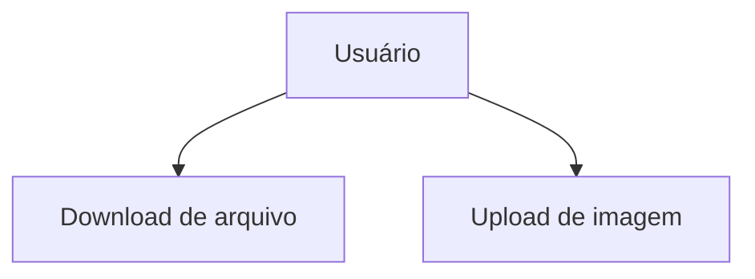

# 🌐 Tipos de Conexões de Rede

A comunicação em redes pode acontecer de diferentes formas, utilizando **meios físicos (com fio)** ou **meios lógicos (sem fio)**. Cada tipo possui características próprias de velocidade, segurança e aplicação.

---

## 🧵 Conexões Físicas (Cabeadas)

As conexões físicas utilizam **cabos condutores** para transportar os dados, codificados como **sinais elétricos (0 e 1)** ou **pulsos de luz**. São os meios mais comuns por sua confiabilidade.

### 🔌 1. Cabo de Cobre (Par Trançado)

- **Mais utilizado atualmente**, principalmente em redes Ethernet.
- Usa **conectores RJ-45** (fêmea nos switches, macho nos cabos).
- Os fios são **trançados** e isolados para reduzir interferência eletromagnética.

#### 🧠 Analogia:
> Imagine dois brinquedos se comunicando por um "telefone" com um fio trançado. Esse fio tem uma ponta chamada RJ-45 que encaixa em “tomadas de rede”.

#### 📈 Tipos de Montagem de Cabo:
| Tipo              | Uso Comum                              |
|-------------------|----------------------------------------|
| **Ethernet Direto** | PC → Switch, PC → Impressora           |
| **Ethernet Cruzado** | PC → PC (sem switch), Switch → Switch |
| **Rollover**        | Conexão entre equipamentos de rede (console) |

---

### 💡 2. Fibra Óptica

- Utiliza **pulsos de luz** para transmitir dados, oferecendo **altíssima velocidade** e **maior alcance**.
- Estrutura:
  - **Núcleo de vidro**
  - **Revestimento reflexivo interno**
  - **Camadas externas de proteção**
- Possui duas portas:
  - **Tx (Transmissão)**
  - **Rx (Recepção)**

#### 🧪 Vantagens:
- Imune a interferências eletromagnéticas.
- Mais segura e difícil de interceptar.

---

## 📡 Conexões Sem Fio (Wireless)

As conexões lógicas **não utilizam cabos físicos**, e sim **ondas de rádio** para a comunicação entre os dispositivos.

### 🛰️ 3. Rede Wi-Fi

- Usada em casas, empresas e locais públicos.
- Baseada em padrões IEEE 802.11 (ex: 802.11ac, 802.11ax).
- Comunicação entre **dispositivo (PC, celular)** e **roteador com antenas**.

#### ⚠️ Desvantagens:
- **Menor segurança**: qualquer um que "ouvir" o sinal e quebrar a senha pode acessar a rede.
- **Interferência**: sinais de rádio são suscetíveis a barreiras físicas, micro-ondas e outros dispositivos.

---

## ⚙️ Como os Dados São Transmitidos?

Todos os meios (físico ou lógico) **trafegam sinais binários**:  
`0 = desligado` | `1 = ligado`

> Ou seja, toda a comunicação na rede é uma sequência de **pulsos elétricos ou de luz** que representam bits.

---

## 📉 Throughput (Taxa Real de Transferência)

- **Throughput** é a **velocidade real** com que os dados são transmitidos, diferente da largura de banda teórica.
- Pode ser medida em **Mbps ou Gbps**.
- Inclui **upload (envio)** e **download (recebimento)**.



# 🔌 Tipos de Conexões de Rede


Existem **3 principais tipos de conexão** utilizados para transmissão de dados em redes:

| Tipo           | Meio            | Exemplo               |
|----------------|------------------|------------------------|
| 🧵 Cobre         | Físico           | Ethernet (par trançado) |
| 💡 Fibra Óptica  | Físico (óptico)  | Rede corporativa       |
| 📡 Sem Fio       | Lógico (wireless)| Wi-Fi, Bluetooth       |

Cada meio possui **um propósito específico**, dependendo de fatores como **velocidade**, **distância**, **custo** e **segurança**.


---

## 📊 Throughput (Vazão Real)

**Throughput** é a **taxa real de transferência de dados**, ou seja, o quanto efetivamente é transmitido entre os dispositivos, medido geralmente em **Mbps ou Gbps**.

- **Upload**: envio de dados
- **Download**: recebimento de dados

> Ex: Um link de 100 Mbps pode entregar 80 Mbps reais, dependendo de congestionamento, meio físico e interferência.

---

## 🧵 Conexão via Cobre

O meio **mais utilizado atualmente** em redes locais (LAN). Baseado em **par trançado** com conectores **RJ-45**.

### 📌 Detalhes Técnicos:

- **Switches** têm portas RJ-45 **fêmeas**
- Os cabos possuem conectores RJ-45 **machos**
- **Trançamento** reduz interferência externa
- Os fios seguem padrões de cor e pinagem (T568A / T568B)

### 🧠 Analogia Simples:

> Imagine dois brinquedos querendo conversar usando "telefones".  
> O "fio" do telefone é o cabo de rede com as pontas **RJ-45**.

### 🔄 Tipos de Cabo Ethernet:

| Tipo             | Finalidade                            |
|------------------|----------------------------------------|
| **Direto**        | PC → Switch, PC → Impressora           |
| **Cruzado**       | PC → PC, Switch → Switch               |
| **Rollover**      | Conexão serial para gerenciamento (ex: roteador console)

---

## 💡 Fibra Óptica

Transmite **pulsos de luz** por um **núcleo de vidro** para transportar dados em **altíssima velocidade** e grandes distâncias.

### 🔬 Estrutura da Fibra:

- **Núcleo**: vidro puro onde passa a luz
- **Revestimento interno (cladding)**: reflete a luz de volta
- **Camada externa**: proteção mecânica e isolação

### 🔁 Conexões Rx e Tx:

- **Rx**: recepção de luz/dados
- **Tx**: transmissão de luz/dados

> O conector óptico envia luz de um lado e recebe do outro — como um "raio laser guiado".

---

## 📡 Conexões Sem Fio (Wireless)

Conectividade baseada em **ondas de rádio**, sem a necessidade de cabos físicos.

### 🔌 Tecnologia Wi-Fi:

- Utiliza o padrão IEEE **802.11**
- Permite a comunicação entre **dispositivos (PCs, celulares)** e **roteadores**
- Frequências mais comuns: **2.4 GHz** e **5 GHz**

```mermaid
graph LR
    A[Notebook] -->|Wi-Fi| B[Roteador Wireless]
    B -->|Internet| C[Modem]
