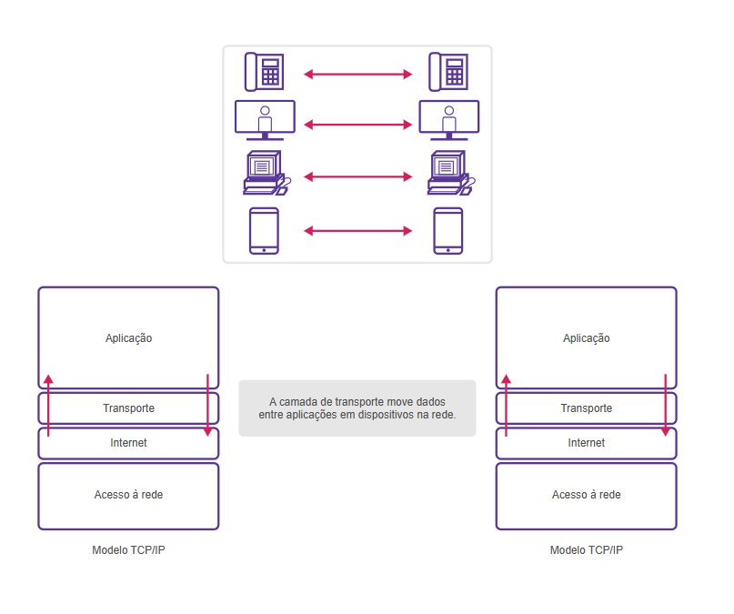
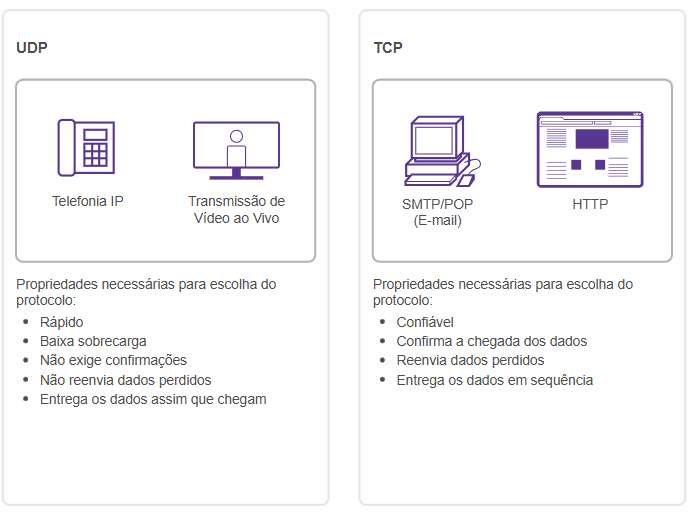
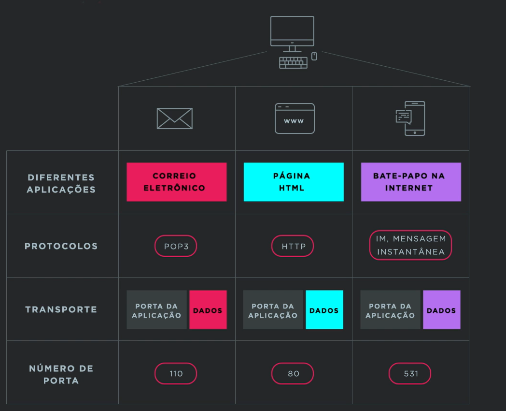

# Camada de Transporte

Estabelece uma sessão de comunicação entre dois aplicativos e fornece dados entre eles

Modelo 4 do OSI - transporte  
Trabalha com protocolo TCP  
Controle de tráfego do transporte  
Camada de transporte

## TCP/IP
Faz transporte/Endereçamento lógico  
Carteiro/N° Casa

Formula toda parte de controle de fluxo 

## Diferença entre TCP e UDP

### UDP
- Rápido
- Baixa Sobrecarga
- Não Exige confirmações
- Não reenvia dados perdidos
- Entregam os dados assim que chegam
- Protocolo não orientado a Conexão

### TCP
- Confiável 
- Confirma a entrega dos dados
- Reenvia dados perdidos
- Entrega dados em sequência
- Protocolo orientado a conexão 

# Handshake - Aperto de mão (TCP Three-Way Handshake)

1. **SYN** - Cliente envia um segmento SYN ao servidor
2. **SYN-ACK** - Servidor responde com SYN-ACK
3. **ACK** - Cliente envia ACK confirmando a conexão
