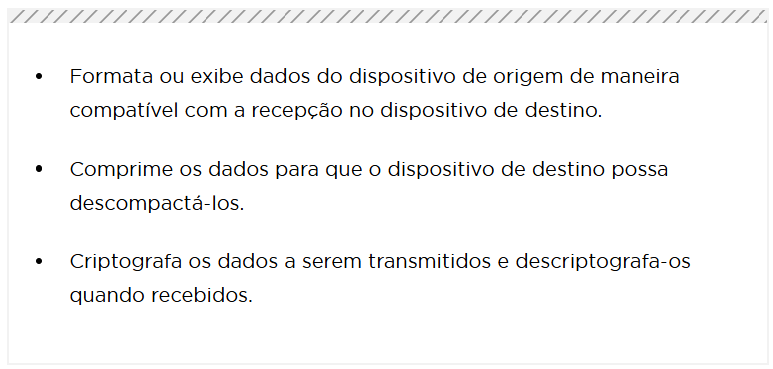

# 🌐 Camada de Aplicação (Application Layer) - Próxima do Usuário Final

A **Camada de Aplicação** é a camada mais próxima do usuário. Ela fornece o **encapsulamento entre o aplicativo utilizado para comunicação e a rede subjacente**, por onde as mensagens são transmitidas. Todas as comunicações das camadas inferiores passam por ela após a camada de transporte.

---

## 📌 Funções da Camada de Aplicação

- Interface entre o usuário e a rede
- Permite comunicação entre softwares e dispositivos
- Trabalha com **dados já processados** pelas camadas inferiores
- Usa protocolos que suportam funcionalidades como **upload, download, e-mails, navegação web, etc.**

---

## 🔧 Protocolos Famosos da Camada de Aplicação

| Protocolo | Descrição |
|----------|----------|
| 🌐 **HTTP** (HyperText Transfer Protocol) | Usado para acessar páginas web |
| 📁 **FTP** (File Transfer Protocol) | Transferência de arquivos |
| 🧪 **TFTP** (Trivial File Transfer Protocol) | Transferência simples de arquivos |
| ✉️ **SMTP** (Simple Mail Transfer Protocol) | Envio de e-mails |
| 📡 **IMAP/POP3** | Leitura de e-mails |
| 🌍 **DNS** (Domain Name System) | Tradução de nomes de domínio para IP |
| 🔄 **DHCP** (Dynamic Host Configuration Protocol) | Distribuição automática de IPs |

---

## 🧠 Camadas Superiores do Modelo OSI

Depois da **Camada de Transporte**, temos:

### 📑 Camada de Sessão (Session Layer)
- Gerencia **sessões de comunicação**
- Realiza a **divisão de tráfego entre origem e destino**

### 🌐 Camada de Apresentação (Presentation Layer)
- Realiza a **tradução de dados**
  - De linguagem de máquina para linguagem humana
  - Ex: criptografia, compressão, conversão de dados

---

## 🔁 Modelo OSI: Recordando

| Camada | Unidade de Dados | Descrição |
|--------|------------------|-----------|
| 🧱 Física        | Bits            | Transmissão física |
| 🔗 Enlace        | Quadros (Frames)| Conexão direta entre dispositivos |
| 🌍 Rede          | Pacotes         | Roteamento e endereçamento IP |
| 📦 Transporte    | Segmentos       | Controle de fluxo e confiabilidade |
| 🧩 Sessão        | Dados           | Controle da comunicação |
| 🧬 Apresentação  | Dados           | Tradução e formatação |
| 🧑 Aplicação     | Dados           | Interface com o usuário final |

---

## 🖥️ Modelo Cliente-Servidor

- **Cliente** solicita informações
- **Servidor** responde com os dados
- Ex: Upload (cliente → servidor), Download (servidor → cliente)

---

## 🤝 Conceitos Extras

- **P2P (Peer-to-Peer)**: Comunicação direta entre dispositivos sem servidor central
- **HTML**: Linguagem de marcação usada em páginas web
- **SMTP/IMAP/POP3**: Protocolos de e-mail

---

## 🌍 DNS e DHCP

- **DNS**: Converte nomes como `www.google.com` em endereços IP como `142.250.190.132`
- **DHCP**: Atribui IPs dinamicamente aos dispositivos em uma rede

---

📸 Imagens associadas:

  

