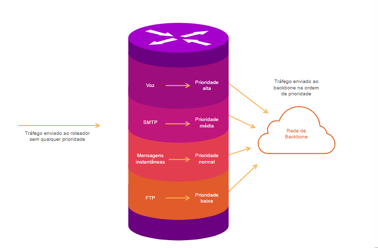

## Serviços e Recursos do Sistema Operacional

* Serviços e Recursos do Sistema Operacional;
* Dependendo da versão do sistema operacional, um dispositivo de rede é compatível com certos recursos e serviços, tais como:
    * Segurança;
    * Qualidade de Serviço (QoS);
    * Voz Sobre IP (VOIP);
    * Switching de Camada 3;
    * Tradução de Endereço de Rede (NAT);
    * Protocolo de Configuração Dinâmica de Host (DHCP).

Entender as nescessidades para comprar
os equipamentos

