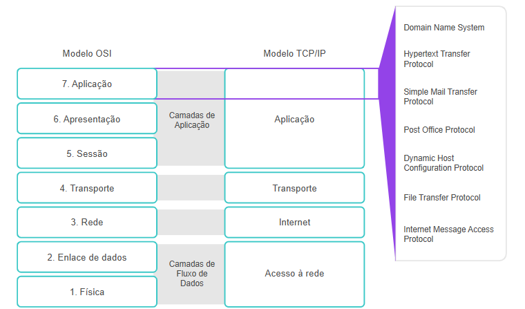

# 📡 Project: Network Infrastructure and Connectivity

This repository aims to organize and present the main concepts of the discipline of Computer Network Infrastructure and Interconnectivity, covering everything from physical connection fundamentals to communication protocols used in modern networks.

---

---

## 📄 Content Files

| File | Description |
|------|-------------|
| `01--Introduction.md` | Overview of computer networks, the importance of connectivity, and the goals of the subject. |
| `02--Connections.md` | Types of network connections such as wired, wireless, point-to-point, among others. |
| `03--Protocols.md` | Explanation of communication protocols (TCP/IP, UDP, HTTP, etc.) and their importance. |
| `04--Connection_Types.md` | Complements previous files, detailing connection types and transmission media. |
| `05--Network_Layer.md` | Study of the Network Layer in the OSI model, focusing on IP addressing, routing, and packet switching. |
| `06--Transport_Layer.md` | Explanation of the Transport Layer, emphasizing TCP and UDP protocols and flow/error control. |
| `07--Application_Layer.md` | Details the Application Layer, including protocols such as HTTP, FTP, DNS, SMTP, and others. |

---

## 📂 Project Content

Each module addresses an essential topic for understanding the structure and functioning of computer networks.

### 01 - Introduction 📚  
Overview of the discipline and definition of key terms.

### 02 - Connections 🔌  
Exploration of physical data transmission media: cables, connectors, and interconnection devices.

### 03 - Protocols 📡  
Study of the main protocols used for communication in networks, focusing on the TCP/IP model.

### 04 - Types of Connections 🌐 
Differences between wired and wireless connections, local area networks (LAN), metropolitan area networks (MAN), and wide area networks (WAN).

### 05 - Network Layer 🏠 
Functioning of the network layer in the OSI model, highlighting IP addressing and routing.

### 06 - Transport Layer 🚚  
Concepts of flow control, transmission reliability, and TCP/UDP protocols.

### 07 - Application Layer 🌍 
User-end services such as DNS, HTTP, FTP, and applications in the Internet of Things (IoT).

---

## 🏷️ Keywords

- Computer Networks  
- Connectivity  
- TCP/IP Protocols  
- IP Addressing  
- Routing  
- TCP and UDP  
- OSI Model  
- Fiber Optics  
- Wi-Fi  
- Network Security  
- Network Infrastructure  
- OSI Layers  
- Data Networks  
- Internet of Things (IoT)  
- Communication Protocols  
- Network Structures

---

## 👨‍💻 Author

**João Henrique Arantes**

- 📧 Email: joaohenri.dev@gmail.com  
- 🌐 LinkedIn: [linkedin.com/in/joaoharv](https://www.linkedin.com/in/joaoharv)  
- 💼 GitHub: [github.com/JhArantes](https://github.com/JhArantes)  

Passionate about technology and network systems, João developed this repository as part of his academic and practical journey in Computer Networks Infrastructure. The project reflects his dedication to organizing and sharing knowledge in a clear and structured way.

---

